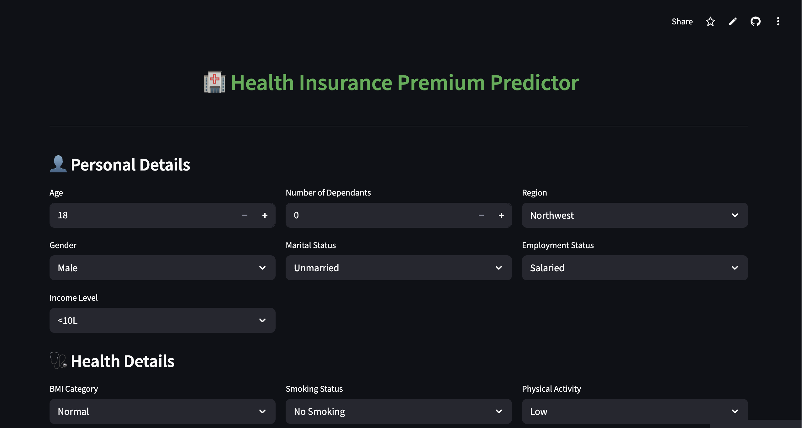

# Health_Insurance_Premium_Predictor

An interactive Streamlit app that predicts **health insurance premiums** based on user inputs like age, BMI, smoking status, and medical history using machine learning.

Live Demo - https://healthinsurancepremiumpredictor.streamlit.app/




## Tools & Technologies

- Python, Streamlit  
- pandas, numpy, seaborn, matplotlib  
- scikit-learn, xgboost, statsmodels

## Setup

```bash
pip3 install -r requirements.txt
streamlit run main.py
